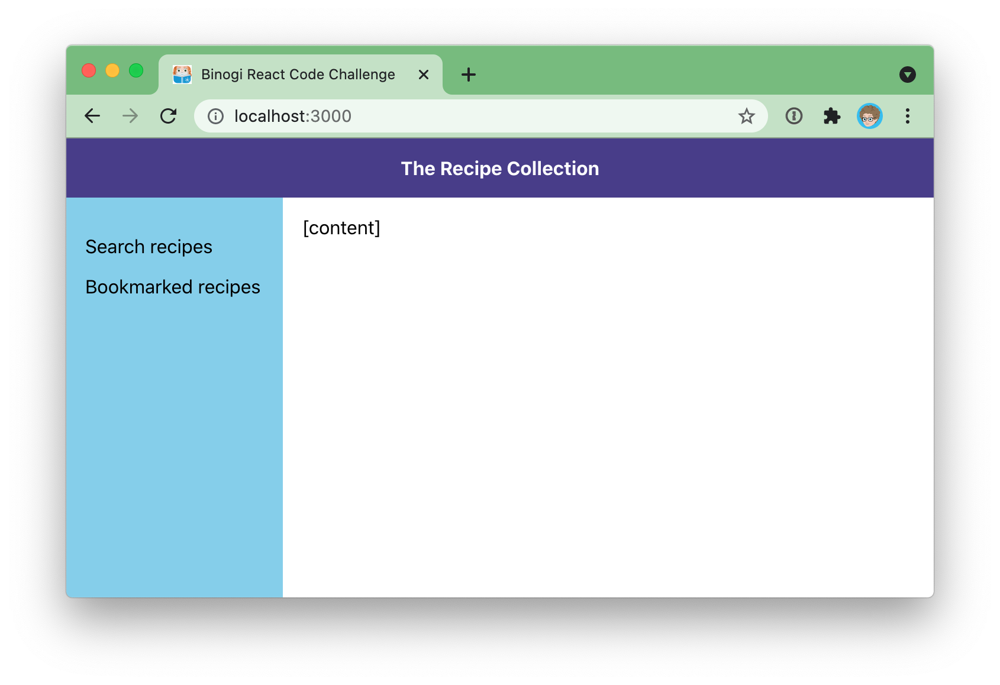

# Binogi React Code Challenge

This code test involves the creation of a working React app using a 3rd party API. It’s designed to take 2-4 hours.



## The Challenge

Create a React web application for searching through the recipes using the public API, and implement a solution for bookmarking the recipes client-side.

The recipes API is called [Edamam Recipe Search API](https://developer.edamam.com/edamam-docs-recipe-api). For the API, you can use our account with Application ID: `df53c267` and Application Key: `bd80595496a524a833554462aa41a04c` (you can also create your own account).

The web application should include the following functionality:

- **Search view**
    - Display a search form with a search field.
    - Optional:
	    - Include advanced search filtering input fields for `diet`, `health`, `cuisineType`, `mealType`, `dishType` and `calories` range.
	    - Display search results list that consists of recipe `picture`, `label`, `calories`, `healthLabels` and `dietLabels`
	    - UI to load more results
- **Recipe Info view/dialog/modal** when a user clicks on recipe search result
	- UI to bookmark the recipe
	- Optional:
	    - Display more information about the recipe like `ingredients`, `nutrients` and `digest` details.
- **Bookmarked Recipes view**
	- List of all bookmarked recipes.
    - Optional:
	    - UI to remove recipes from the list.

## Requirements and Restrictions

- The app must be built using React.
- Feel free to use any libraries/plugins that you need.
- Try to make the UI look “nice enough”. You can scrap and replace the existing UI completely if you want.
- Focus on code quality and structure.

### Optional:

- Implement a solution to store and manage the app’s state
	- Use state at least for handling bookmarks
- Use `localStorage` as a persistence layer for the state
- Use TypeScript
- Write some unit-tests
- Make it look good on mobile as well as desktop

## Getting started

This repository is setup with `create-react-app` to get you started quickly. To start the app you just need to clone the repository and run the following commands:

```sh
# install node_modules
yarn
# start the app
yarn start
```
